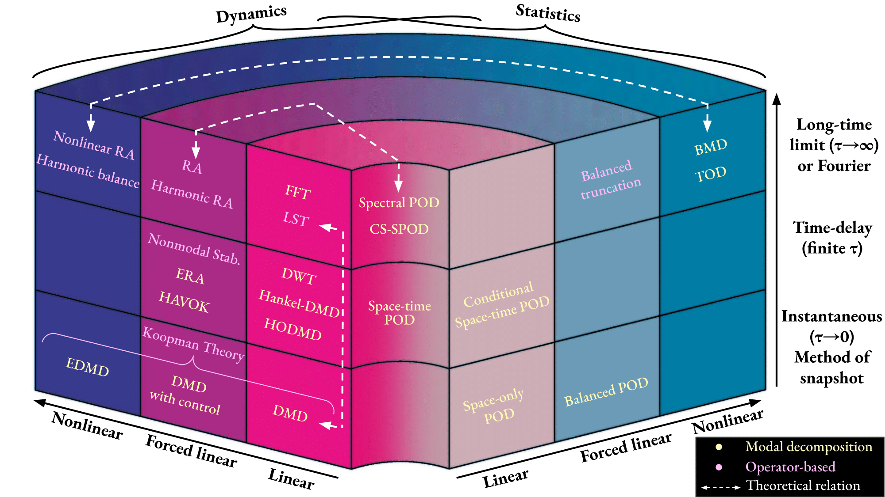
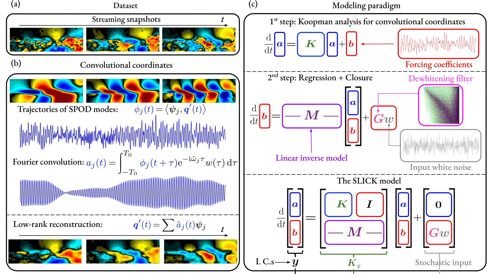
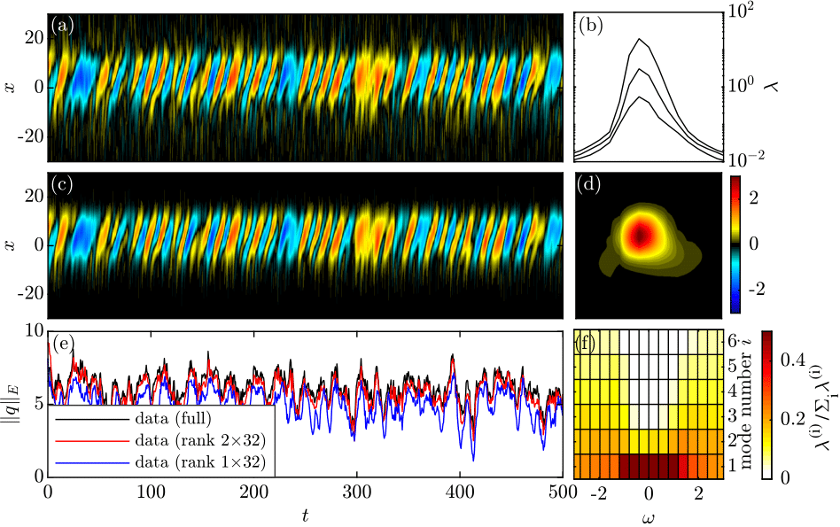

## The Stochastic Low-dimensional Inflated Convolutional Koopman model (SLICK)

## Model-order reduction

The choice of model order reduction usually goes hand-in-hand with the modal basis.
We categorize the approaches for identifying flow instabilities using three perspectives:
* Physical aspects (statistics or dynamics),
* State vector (linear $\to$ forced linear $\to$ nonlinear),
* Time-delay horizon (instantaneous $\to$ finite $\to$ long-time limit).
  
Note that all the methods here are applied to analyze general nonlinear fluid flows. The terminology 'linear,' 'forced linear,' and 'nonlinear' pertains to the state vector under analysis.

## SLICK

A graphical summary of the stochastic low-dimensional inflated convolutional Koopman (SLICK) model is shown. It has the following steps: 
* Collecting data as equally sampled snapshots,
* Performing model-order reduction and Fourier convolution,
* Training the SLICK model.

The turbulent open cavity flow is demonstrated as an example. 
While the model encompasses complex concepts, it can be formulated using a simple discrete-time algorithm.

## Stochastic complex Ginzburg-Landau equation

Here, we consider the SCGL equation, which is widely used as a model to study instabilities in spatially evolving flows.

